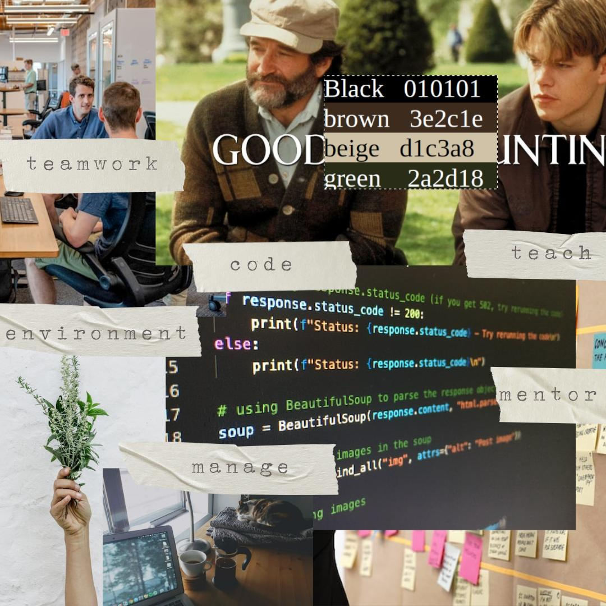
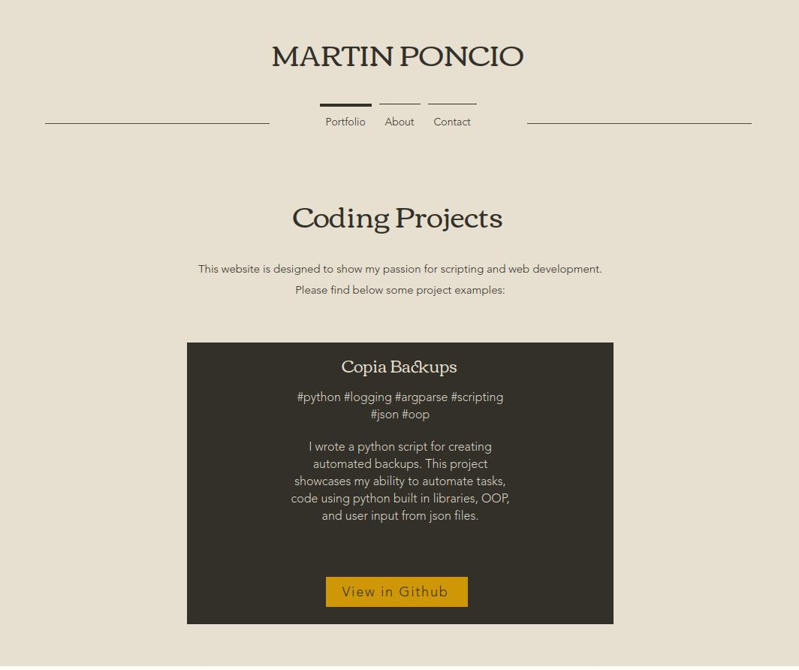
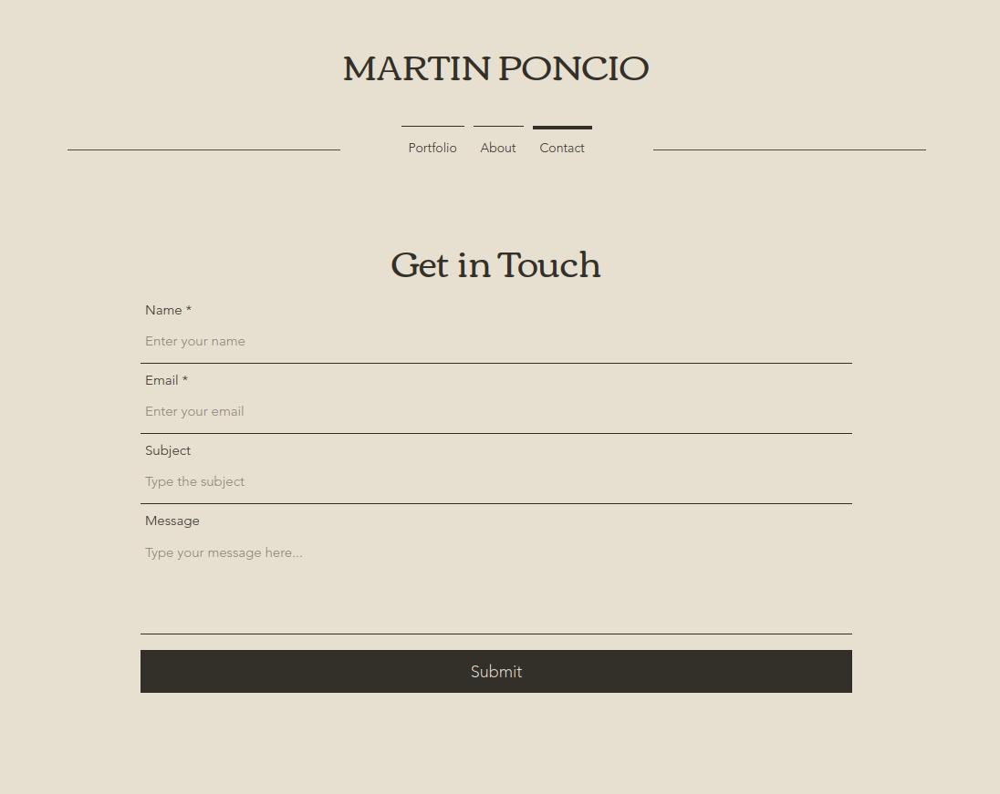
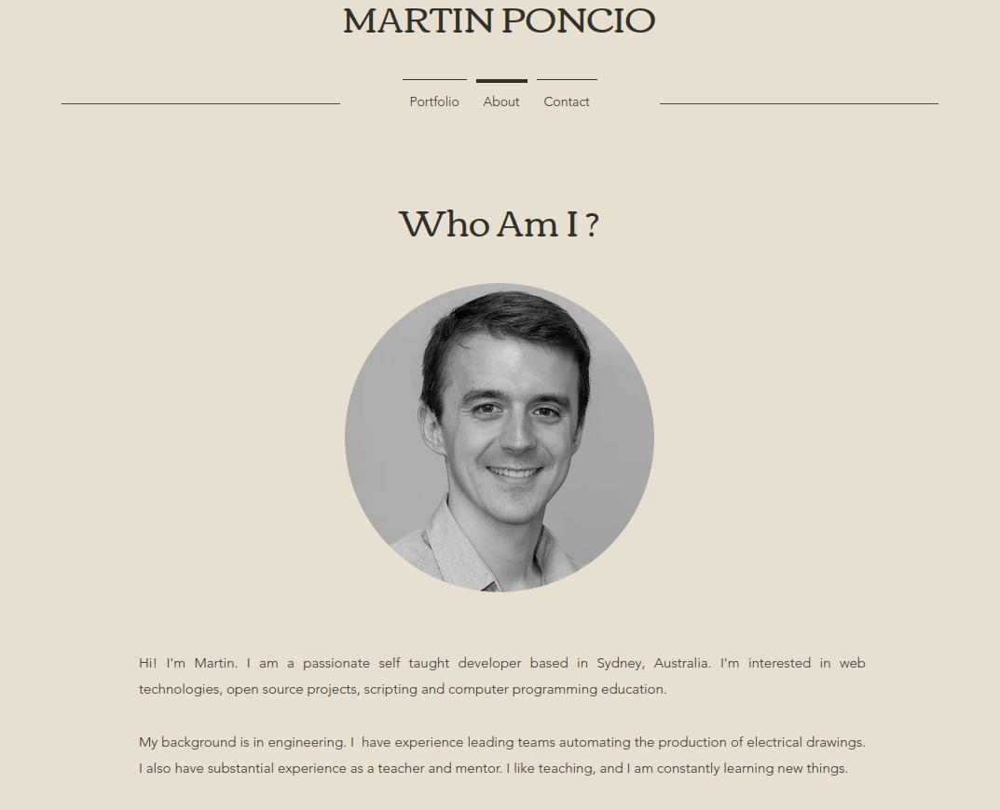

# Web Design Learning
This repository summarizes my learnings in the [Get into Tech course by INCO Academy](https://www.inco.org.au/get-into-tech). The course is much richer than web design alone, but since the capstone project was a web page and I was lucky to have as fascilitator [a UX Designer](https://www.linkedin.com/in/natalia-bornay/), I decided to showcase here some of my work.

For this project I focused in the UX/UI, did some usability testing, and iterated based on the knowledge acquired. I used a website builder for the code not to get in the way of my learning. Later, I would apply these same concepts in my website [Alone in the Sea](https://aloneinthesea.com/), where I also write the code of the site.

## A mood board
I did multiple iterations of mood boards. It was my first time doing a visual brainstorming, so it took me a bit of time to grasp the concept. My main issue was that I had too many ideas going on, so the color palette was hard to define (see my first iteration [here](./media/mood1.jpeg)). A trick that I found was to choose an image from a movie that I felt fit into the mood, and take colors from there (I also [used this approach in Alone in the Sea](https://aloneinthesea.com/assets/images/2022-12-18-palette.jpg)). Below I show my final mood board:

## The Home Page and a Call to Action
Once of the main concepts that I always come back to is "people look at web pages for very little time, so we want to choose carefully what we put in the home page". 

In my case, I was designing a portfolio website, so I decided to show projects in the home page. My first design maintained the mood in the whole page, with no button calling the attention, and with no bright colors anywhere. The page looked good, but it didn't prompt you to do anything - that's when I learned what a "Call to Action" is. I decided that the link to see the project would have a brighter color, helping the user to know where to click next. 

## Usability testing
Testing looks simple, and it is challenging. It is very easy to accidentally provide too much information to the user, or unintentionally guide them instead of letting them interact with the product.

Through testing I learned if users could understand what the site was about - other part of the test was to ask users to get in contact with me.

## Conclusion

The [Get into Tech course](https://www.inco.org.au/get-into-tech) was a great experience for me. Even I already know how to code scripts, this course broaden my horizons - I learned a bit a bout UX/UI, Marketing, Data Engineering, Networking, Career paths, and more. 

In the end, I decided to not publish the web page I designed because I already have GitHub to showcase my work. At least this small repo tells about my experience and the learning I got from it.

